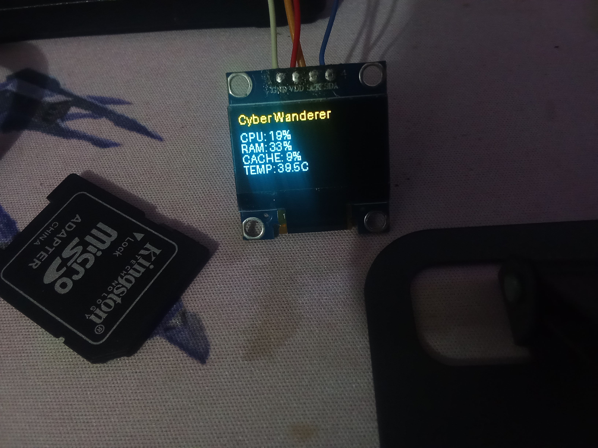
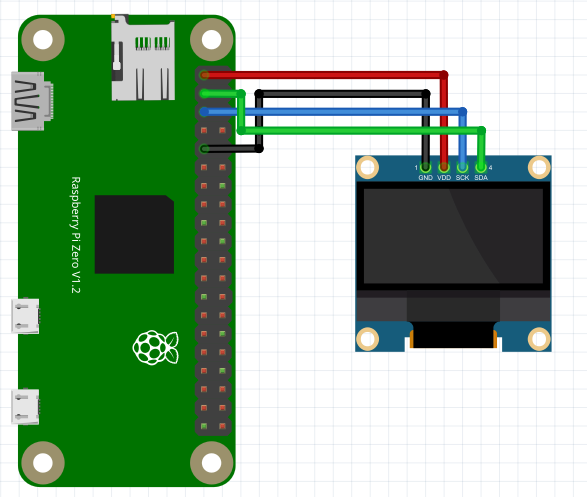

# Sistema de analise de dados do Cyber Deck:
## O sistema de analise  foi desenvolvido em Python e configurado para inicializar automaticamente junto com o sistema operacional, utilizando o Debian 13 como plataforma principal.

<div style="display: flex; gap:30px;">
    
    
</div>

# comandos para fazer o sistema inicializar quando ligar
```bash
    #cirar um srvice
    sudo nano /etc/systemd/system/name.service
```
### configuração do serviço
```bash
[Unit]
Description= oq ele vai fazer 
After=multi-user.target

[Service]
Type=simple
ExecStart=caminho do seu script
Restart=always
User=root

[Install]
WantedBy=multi-user.target
```
### Ativação do serviço
```bash
1: sudo systemctl daemon-reload 
2: sudo systemctl enable name.service
3: sudo systemctl start name.service
```
# Sistema de limpesa de cache:
Um sistema de limpeza de cache remove automaticamente arquivos temporários acumulados no sistema, liberando memória e ajudando a manter o computador organizado. Quando configurado corretamente, pode melhorar o gerenciamento dos recursos e contribuir para a estabilidade, especialmente em sistemas que permanecem ligados por longos períodos. No entanto, a limpeza excessiva pode reduzir o desempenho, pois o sistema precisará recriar os dados em cache.
## code

```bash
import os
import time
while True:
        os.system("sync")
        with open("/proc/sys/vm/drop_caches", "w") as f:
                f.write("3\n")

        time.sleep(30)
```

# Hardware:
## teclado


O teclado do Cyber Deck KNTECK foi desenvolvido inteiramente do zero, desde o projeto eletrônico até a montagem e programação. Seu design personalizado foi criado para atender às necessidades do equipamento, oferecendo um layout exclusivo, compacto e funcional, garantindo maior controle, durabilidade e integração com o sistema.

